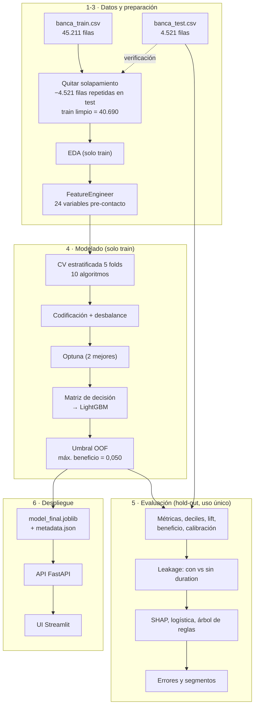
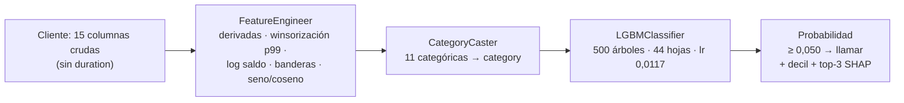

# Diagramas del pipeline

Los PNG se generan con `python -m bank_captacion.diagram`, que los dibuja con matplotlib porque
no hay Mermaid CLI instalado. Los diagramas Mermaid de abajo son equivalentes y se ven directo en
GitHub o en VS Code.

## 1. Flujo completo del proyecto

## 2. Pipeline del modelo final

