# Predicción de captación de clientes en campañas de marketing bancario

<!-- center -->**Trabajo Práctico Final — Aprendizaje Artificial**

<!-- center -->Maestría en Gestión y Desarrollo de Inteligencia Artificial · Universidad CAECE

<!-- center -->Docentes: Juan Azcurra · Paul Pablo Hernán

<!-- center -->Autor: Fernando Caceres

<!-- center -->Fecha: 28/09/2026

<!-- pagebreak -->

## Resumen ejecutivo

El trabajo construye un modelo que **ordena a los clientes potenciales según su probabilidad de
convertirse en clientes del banco**, para decidir a quién contactar en una campaña telefónica con
presupuesto limitado. Se siguió la metodología CRISP-DM de punta a punta: comprensión del negocio y
de los datos, preparación, modelado, evaluación y despliegue.

**Tratamiento de los datos.** Durante la inspección se detectó que **las 4.521 filas del archivo
de test estaban contenidas en el archivo de entrenamiento** (el dataset *Bank Marketing* de UCI
distribuye `bank.csv` como una muestra de `bank-full.csv`). Esas filas se eliminaron del
entrenamiento, que quedó en 40.690 registros, para que la evaluación final se hiciera sobre
datos no vistos.

**Modelo pre-contacto.** Se excluyó la variable `duration` (duración de la llamada): solo se conoce
después de llamar, por lo que usarla constituiría una fuga de información.

**Modelos comparados.** Se compararon diez algoritmos de distintas familias con el mismo protocolo
de validación cruzada estratificada de 5 folds. También se evaluaron:

- tres estrategias de desbalance;
- dos codificaciones de variables categóricas;
- un ajuste de hiperparámetros con Optuna.

**Modelo elegido.** Mediante una matriz de decisión ponderada se eligió **LightGBM** sin
tratamiento de desbalance y con categorías nativas. Obtuvo en validación cruzada:

- PR-AUC de 0,466 ± 0,020;
- ROC-AUC de 0,806.

**Resultados en el hold-out** (4.521 clientes, evaluado una única vez):

| Métrica | Modelo final | Regresión logística | Azar |
|---|---|---|---|
| ROC-AUC | 0,784 | 0,738 | — |
| PR-AUC | 0,435 | 0,349 | 0,115 |

Estos valores están dentro del rango de referencia para este dataset sin `duration` (0,75–0,80).

**Lectura de negocio:**

- Contactando al 10 % de clientes mejor rankeado se captura el 42,2 % de las conversiones,
  con un lift de 4,21.
- Contactando al 20 % se captura el 59,7 %.
- Con los supuestos económicos adoptados (valor de una conversión = 20 veces el costo de una
  llamada), el umbral de máximo beneficio es 0,050. Con él se contacta al 61,1 % de
  los clientes y se captura el 86,6 % de las conversiones.
- El beneficio esperado supera en 6,1 % al de contactar a todos.
- El valor del modelo crece cuando la llamada es más cara en relación con la conversión: con un
  ratio 10:1 el modelo triplica el beneficio de la estrategia de contactar a todos.

**Explicabilidad y despliegue:**

- La explicabilidad (SHAP, regresión logística y un árbol de reglas) coincide en las variables
  clave: el mes del contacto, el canal, el saldo, la tenencia de préstamos y el éxito en campañas
  anteriores.
- El modelo se despliega mediante una API REST (FastAPI) y una interfaz web (Streamlit) que
  permiten puntuar clientes individuales o listados completos.

<!-- pagebreak -->

## 1. Comprensión del negocio

### 1.1 Problema y decisión

Un banco realiza campañas de marketing telefónico para captar clientes para un depósito a plazo.
Cada contacto tiene un costo y solo una minoría de los contactados se convierte
(11,72 % en los datos de entrenamiento).

La decisión que apoya el modelo es la siguiente:

> Dado un listado de clientes potenciales y un presupuesto de contactos, ordenarlos según su
> probabilidad de conversión y contactar a los primeros *k*.

Por lo tanto, el modelo se evalúa principalmente como una **herramienta de ranking**. La decisión
binaria (llamar o no llamar) surge de aplicar un umbral económico sobre la probabilidad estimada.

### 1.2 Restricción: información disponible antes del contacto

El modelo se utiliza **antes** de llamar. En consecuencia, se excluye toda variable que solo se
conoce después del contacto. El caso central es `duration`:

- la duración de la llamada se conoce al finalizarla;
- además, es en buena medida *consecuencia* del interés del cliente.

El modelo entregable se denomina **modelo pre-contacto**. Se entrenó una variante con `duration`
exclusivamente para cuantificar el efecto de esa fuga (sección 5.5).

### 1.3 Métricas

| Tipo | Métrica | Justificación |
|---|---|---|
| Primaria | PR-AUC (average precision) | Resume la calidad del ranking sobre la clase minoritaria; su valor al azar es la prevalencia (~0,117) |
| Primaria | Lift y gain en el top 10 %, 20 % y 30 % | Traducen el ranking a la decisión: qué proporción de las conversiones se captura contactando a una fracción de los clientes |
| Secundaria | ROC-AUC | Permite contrastar con la literatura |
| Secundaria | Precision, recall y F1 al umbral operativo | Describen la decisión binaria |
| Secundaria | Brier y curva de calibración | Verifican que las probabilidades puedan interpretarse como tales, lo cual es necesario para el cálculo económico |

**Por qué no accuracy.** Con 88,3 % de clientes que no se convierten, un modelo que responde
siempre "no" alcanza 88,3 % de accuracy sin identificar a ningún cliente. Accuracy premia acertar
la clase mayoritaria, mientras que el valor de negocio está en encontrar a la minoría que se
convierte.

### 1.4 Marco económico

Se definió un costo por contacto **C = 1** y un valor esperado por conversión **V = 20**. El
beneficio esperado de contactar a un conjunto de clientes es:

$$\text{Beneficio} = V \cdot TP - C \cdot (TP + FP)$$

Contactar a un cliente con probabilidad *p* conviene si *p·V > C*, es decir, si *p > C/V = 0,05*.

Los valores C y V son **supuestos ilustrativos**; lo relevante es su cociente. Por ello se analiza
la sensibilidad para V/C = 5, 10, 20 y 50. El banco puede reemplazarlos por valores reales:

- **C**: costo del operador, de la telefonía y del desgaste por contacto;
- **V**: margen neto del producto más el valor de vida del cliente.

Ambos valores se modifican en `config.py` y el pipeline recalcula el umbral y el análisis económico.

<!-- pagebreak -->

## 2. Comprensión de los datos

### 2.1 Archivos y verificaciones

**Archivos recibidos:**

| Archivo | Equivale a | Filas | Tasa de conversión |
|---|---|---|---|
| `banca_train.csv` | `bank-full.csv` | 45.211 | 11,70 % |
| `banca_test.csv` | `bank.csv` | 4.521 | 11,52 % |

Ambos archivos tienen 17 columnas, separador `;` y encoding ASCII. Los datos corresponden al
dataset *Bank Marketing* (Moro, Cortez y Rita, 2014; UCI Machine Learning Repository), con
campañas realizadas entre mayo de 2008 y noviembre de 2010.

**Verificaciones realizadas:**

- El esquema coincide con el diccionario de la consigna.
- No hay valores nulos ni duplicados exactos dentro de cada archivo.

**Hallazgo crítico: solapamiento.**

- Una comparación fila por fila mostró que las 4.521 filas de test (100 %) aparecen idénticas
  en train.
- Utilizar los archivos tal como fueron entregados habría implicado evaluar el modelo sobre datos
  vistos durante el entrenamiento.
- Esas filas se eliminaron del conjunto de entrenamiento, que quedó en 40.690 registros
  (4.768 conversiones, 11,72 %).
- El proceso completo está registrado en la tabla 1 y en `docs/03_preparacion_datos.md`.

**Naturaleza de la partición.** El archivo de entrenamiento está ordenado cronológicamente, por
lo que se verificó si el test correspondía a un período posterior:

- Las posiciones de las filas de test dentro del archivo son compatibles con una distribución
  uniforme (Kolmogorov-Smirnov D = 0,014, p = 0,37).
- Las distribuciones de mes, canal, resultado previo y target no difieren entre ambos conjuntos
  (χ² con p = 0,47, 0,54, 0,20 y 0,72).
- Conclusión: la partición es **aleatoria**, y se valida con validación cruzada estratificada.

*Tabla 1. Registro de operaciones sobre filas.*

| # | Paso | Conjunto | Filas antes | Filas después | Detalle |
|---|---|---|---|---|---|
| 1 | load | train | 45.211 | 45.211 | banca_train.csv leído con sep=';' y encoding ASCII; esquema validado (17 columnas). |
| 2 | load | test | 4.521 | 4.521 | banca_test.csv leído con sep=';' y encoding ASCII; esquema validado (17 columnas). |
| 3 | check_exact_duplicates | train | 45.211 | 45.211 | Duplicados exactos dentro de train: 0. No se elimina nada. |
| 4 | check_exact_duplicates | test | 4.521 | 4.521 | Duplicados exactos dentro de test: 0. No se elimina nada. |
| 5 | check_nulls | train+test | 49.732 | 49.732 | Nulos: train=0, test=0. Los faltantes vienen codificados como la categoría 'unknown' y pdays=-1. |
| 6 | remove_train_test_overlap | train | 45.211 | 40.690 | 4521 de 4521 filas de test (100.0 %) aparecen idénticas en train (bank.csv es una muestra de bank-full). Se quitan de train para que el hold-out sea independiente. |
| 7 | save_processed | train | 40.690 | 40.690 | Guardado en data/processed/train_clean.csv (sin transformar variables). |
| 8 | save_processed | test | 4.521 | 4.521 | Guardado en data/processed/test_clean.csv (idéntico al original). |

### 2.2 Análisis exploratorio

El análisis exploratorio se realizó solo sobre el conjunto de entrenamiento limpio
(`notebooks/01_eda.ipynb`).

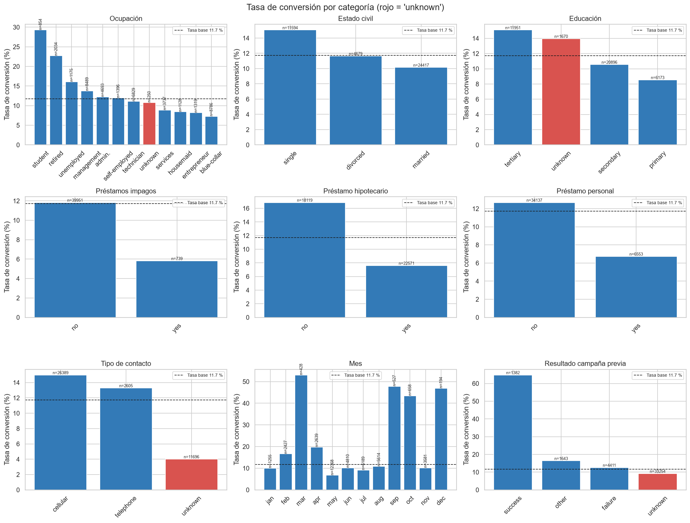

**Valores `unknown`.** No constituyen faltantes aleatorios:

- **`contact = unknown`** (28,7 % de los registros):
  - convierte 4,0 % frente a 14,8 % del resto;
  - ocupa el 100 % del primer 20 % del archivo, es decir, corresponde a un período sin registro
    del canal.
- **`poutcome = unknown`** (81,7 %) equivale a "nunca contactado en una campaña
  previa".
- **`education = unknown`** convierte 14,0 %, más que la moda.

En consecuencia, se mantienen como una categoría propia.

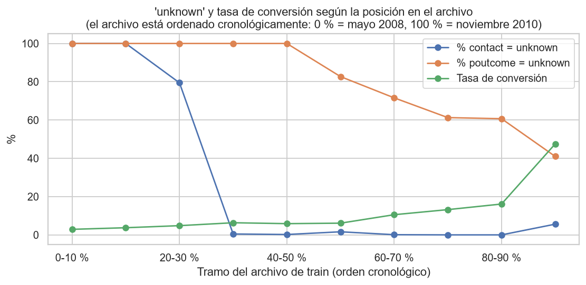

**`pdays = -1`.** Las 33.249 filas con `pdays = -1` (81,7 %) son exactamente
las que tienen `previous = 0` y `poutcome = unknown`. El valor -1 es un código, no una cantidad de
días. Tasas de conversión:

- nunca contactados: 9,2 %;
- contactados en una campaña previa: 23,1 %;
- con resultado previo exitoso: **64,8 %**.

**Mes y volumen.**

- Mayo concentra el 30,4 % de los contactos con una tasa de 6,7 %.
- Los meses con pocas llamadas (marzo, septiembre, octubre, diciembre) superan el 40 %.
- La correlación de Spearman entre volumen y tasa es -0,84.

El efecto refleja la operación del banco y el período, más que una estacionalidad del cliente.

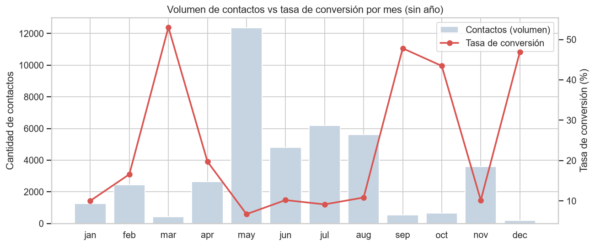

**Outliers:**

- **`balance`**:
  - varía entre -8.019 y 102.127, con asimetría 8,5 y 10,4 % de outliers
    según la regla IQR;
  - tiene 8,4 % de saldos negativos y 7,8 % de saldos nulos;
  - son valores reales, por lo que se transforman en lugar de eliminarse.
- **`campaign`**:
  - llega a 63 contactos (p99 = 17);
  - la conversión cae de 14,7 % con un contacto a 6,4 % con cinco o más.

**`duration` como leakage:**

- Por sí sola alcanza un ROC-AUC de 0,807.
- La mediana es de 164 s en los que no se convierten y de 424 s en los que
  se convierten.
- Las llamadas de menos de 60 s convierten 0,2 %.
- Hay 3 llamadas con duración 0.

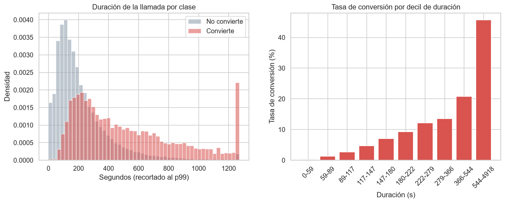

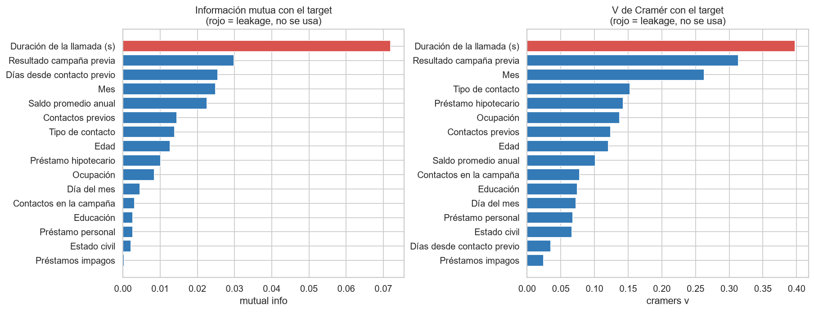

<!-- pagebreak -->

## 3. Preparación de los datos

Todas las transformaciones de columnas se implementaron dentro de un `Pipeline` de scikit-learn o
imbalanced-learn. Esto tiene dos consecuencias:

- en cada fold de validación se ajustan únicamente con los datos de entrenamiento, lo que evita
  fugas de información;
- el modelo final guardado recibe los datos crudos y aplica exactamente las mismas
  transformaciones.

*Tabla 2. Variables derivadas y su justificación.*

| Variable | Origen | Transformación | Justificación |
|---|---|---|---|
| age | age | Sin cambios | Edad numérica. |
| age_group | age | Bins <25, 25-34, 35-44, 45-54, 55-64, 65+ | Efecto no lineal: conversión alta en jóvenes y mayores de 60. |
| balance_log | balance | sign(x)·log(1+|x|) | Saldo muy asimétrico (asimetría 8,5) con negativos: reduce la influencia de extremos sin eliminarlos. |
| balance_negative | balance | 1 si balance < 0 | 8,4 % de clientes en descubierto. |
| balance_zero | balance | 1 si balance = 0 | 7,8 % de clientes sin saldo. |
| campaign_w | campaign | Winsorizado al p99 del fold de entrenamiento | Cola larga (máx. 63); el p99 se aprende en fit para no usar información del fold de validación. |
| previous_w | previous | Winsorizado al p99 del fold de entrenamiento | Cola larga; mismo criterio que campaign. |
| pdays_clean | pdays | NaN cuando pdays = -1 | El -1 no es un número de días; el faltante se imputa luego según la familia de modelo. |
| previously_contacted | pdays | 1 si pdays != -1 | Conserva explícitamente la información 'nunca contactado' (23,1 % vs 9,2 % de conversión). |
| day_sin / day_cos | day | sin/cos(2π·day/31) | El día del mes es cíclico: el 31 está cerca del 1. |
| contact_known | contact | 1 si contact != unknown | contact=unknown corresponde a un período sin registro del canal (4,0 % de conversión). |
| prev_campaign_success | poutcome | 1 si poutcome = success | Señal más fuerte disponible antes de llamar (64,8 % de conversión). |
| season | month | Estación del año (hemisferio norte) | Agrupa meses de bajo volumen para estabilizar su estimación. |
| n_credit_products | housing, loan, default | Suma de yes en housing + loan + default | Tener préstamos reduce la conversión; resume la carga crediticia. |
| job, marital, education, default, housing, loan, contact, month, poutcome | originales | Categóricas sin cambios ('unknown' se mantiene como categoría) | unknown no es un faltante aleatorio (ver EDA). |
| duration | duration | Solo en el conjunto with_duration | Leakage: se conoce después de la llamada. Excluida del modelo entregable. |

**Preprocesamiento según la familia de modelo:**

- **Modelos lineales, KNN, MLP y SVM**: imputación por mediana, estandarización y codificación
  one-hot (67 columnas).
- **Árboles y boosting**: sin escalado (son invariantes a transformaciones monótonas), con one-hot
  o con categorías nativas.
- **Naive Bayes categórico**: discretización en quintiles.

**Decisiones deliberadas:**

- no se imputaron los `unknown`;
- no se eliminaron outliers;
- no se utilizó `duration`.

El documento `docs/03_preparacion_datos.md` detalla cada operación.

<!-- pagebreak -->

## 4. Modelado

### 4.1 Protocolo

Se utilizó `StratifiedKFold(n_splits=5, shuffle=True, random_state=42)` sobre los 40.690
registros. Todos los modelos usan exactamente la misma partición y se reporta la media ± el desvío
estándar entre folds. El conjunto de test no interviene en ninguna decisión de esta fase.

### 4.2 Algoritmos y justificación

Se compararon diez algoritmos que representan las familias vistas en la materia:

| Algoritmo | Familia | Por qué se incluye |
|---|---|---|
| Dummy (prior) | Referencia | Piso de comparación |
| Regresión logística | Lineal | Baseline interpretable |
| Árbol de decisión | Árboles | Genera reglas explicables |
| KNN (k = 51) | Basado en instancias | Clasificación por similitud |
| Naive Bayes categórico | Probabilístico | Modelo generativo |
| Random Forest | Bagging | Reduce varianza |
| LightGBM y XGBoost | Boosting | Estado del arte en datos tabulares |
| MLP | Redes neuronales | Representante de la familia |
| SVM RBF | Kernels | Frontera no lineal de máximo margen |

La SVM se entrenó sobre una submuestra estratificada de 10.000 filas por su costo cuadrático.

*Tabla 3. Resultados de validación cruzada (modelo pre-contacto).*

| Modelo | Familia | PR-AUC | ROC-AUC | Lift@20 % | Brier | Ajuste (s) |
|---|---|---|---|---|---|---|
| LightGBM | Ensamble (boosting) | 0,457 ± 0,020 | 0,803 ± 0,011 | 3,12 ± 0,08 | 0,146 | 0,8 |
| XGBoost | Ensamble (boosting) | 0,454 ± 0,021 | 0,799 ± 0,011 | 3,07 ± 0,08 | 0,146 | 1,1 |
| Random Forest | Ensamble (bagging) | 0,446 ± 0,023 | 0,797 ± 0,010 | 3,10 ± 0,04 | 0,114 | 2,7 |
| Red neuronal (MLP 64-32) | Redes neuronales | 0,430 ± 0,020 | 0,789 ± 0,012 | 3,01 ± 0,07 | 0,083 | 1,4 |
| Regresión logística | Lineal | 0,412 ± 0,012 | 0,776 ± 0,008 | 2,85 ± 0,09 | 0,180 | 0,4 |
| K vecinos más cercanos (k=51) | Basado en instancias | 0,401 ± 0,020 | 0,771 ± 0,007 | 2,83 ± 0,06 | 0,085 | 0,1 |
| Naive Bayes categórico | Probabilístico | 0,395 ± 0,019 | 0,761 ± 0,007 | 2,74 ± 0,11 | 0,114 | 0,1 |
| SVM RBF (submuestra 10k) | Márgenes / kernels | 0,362 ± 0,020 | 0,774 ± 0,007 | 2,98 ± 0,09 | n/a | 2,7 |
| Árbol de decisión (prof. 6) | Árboles | 0,351 ± 0,020 | 0,754 ± 0,011 | 2,76 ± 0,11 | 0,184 | 0,2 |
| Dummy (prior) | Referencia | 0,117 ± 0,000 | 0,500 ± 0,000 | 0,28 ± 0,03 | 0,103 | 0,1 |

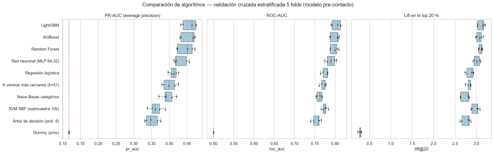

**Interpretación de los resultados:**

- **Ensambles de árboles**: forman el grupo superior (PR-AUC 0,446–0,457),
  casi cuatro veces el valor del Dummy (0,117).
- **Regresión logística** (0,412): la brecha con los ensambles mide el valor de capturar
  no linealidades e interacciones.
- **KNN y Naive Bayes**: rinden menos. KNN se ve afectado por la alta dimensionalidad del one-hot y
  Naive Bayes por la suposición de independencia, dado que existen variables redundantes.
- **SVM**: presenta un ROC-AUC competitivo pero la peor PR-AUC entre los modelos no triviales;
  ordena peor la parte alta del ranking.

### 4.3 Codificación de categóricas y desbalance

*Tabla 4. Codificación en boosting.*

| Modelo | Codificación | PR-AUC | ROC-AUC |
|---|---|---|---|
| lightgbm | One-hot | 0,457 ± 0,020 | 0,803 |
| lightgbm | Nativa | 0,458 ± 0,021 | 0,802 |
| xgboost | One-hot | 0,454 ± 0,021 | 0,799 |
| xgboost | Nativa | 0,451 ± 0,021 | 0,798 |

**Codificación.** Se eligió la codificación nativa para LightGBM y one-hot para XGBoost. La regla
fue preferir la opción nativa salvo que la otra superara la PR-AUC en más de 0,003.

*Tabla 5. Estrategias de desbalance sobre los tres mejores modelos.*

| Modelo | Estrategia | PR-AUC | ROC-AUC | Lift@20 % | Brier |
|---|---|---|---|---|---|
| lightgbm | Sin tratamiento | 0,459 ± 0,020 | 0,804 | 3,12 | 0,081 |
| lightgbm | Pesos de clase | 0,458 ± 0,021 | 0,802 | 3,11 | 0,144 |
| lightgbm | SMOTE | 0,455 ± 0,023 | 0,802 | 3,11 | 0,082 |
| xgboost | Sin tratamiento | 0,452 ± 0,018 | 0,802 | 3,09 | 0,082 |
| xgboost | Pesos de clase | 0,454 ± 0,021 | 0,799 | 3,07 | 0,146 |
| xgboost | SMOTE | 0,451 ± 0,018 | 0,801 | 3,10 | 0,082 |
| random_forest | Sin tratamiento | 0,451 ± 0,024 | 0,799 | 3,13 | 0,082 |
| random_forest | Pesos de clase | 0,446 ± 0,023 | 0,797 | 3,10 | 0,114 |
| random_forest | SMOTE | 0,436 ± 0,025 | 0,794 | 3,07 | 0,087 |

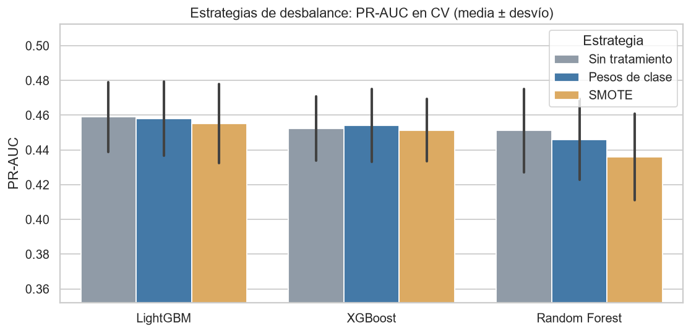

**Desbalance.** Las tres estrategias difieren en PR-AUC menos que un desvío estándar entre folds.
Sin embargo:

- Los **pesos de clase descalibran** las probabilidades: el Brier de LightGBM pasa de
  0,081 a 0,144.
- **SMOTE** genera clientes sintéticos por interpolación entre variables one-hot, lo cual carece
  de interpretación, y empeora al Random Forest.

Como el umbral y el análisis económico requieren probabilidades calibradas, se eligió **no aplicar
tratamiento y ajustar el umbral**.

### 4.4 Ajuste de hiperparámetros

Se utilizó Optuna con sampler TPE (semilla 42), 60 trials por modelo y un tope de 15 minutos por
búsqueda. El objetivo fue la PR-AUC media en los mismos 5 folds.

*Tabla 6. Resultados del tuning.*

| Modelo | Trials | Tiempo (s) | PR-AUC por defecto | PR-AUC tuneado | Mejores hiperparámetros |
|---|---|---|---|---|---|
| lightgbm | 60 | 69 | 0,4589 | 0,4660 | n_estimators=500, learning_rate=0,0117, num_leaves=44, min_child_samples=20, subsample=0,6797, colsample_bytree=0,6304, reg_lambda=0,0028, reg_alpha=0,0039 |
| xgboost | 60 | 71 | 0,4522 | 0,4629 | n_estimators=500, learning_rate=0,0230, max_depth=8, min_child_weight=30,9075, subsample=0,9927, colsample_bytree=0,4401, reg_lambda=0,1119, gamma=0,0036 |

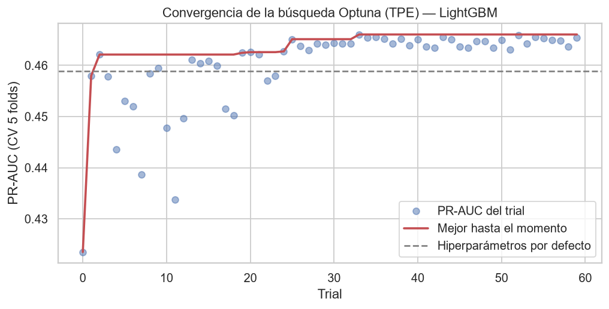

**Lectura:**

- La mejora obtenida es pequeña: de 0,4589 a 0,4660 en LightGBM.
  El techo lo impone la información disponible antes del contacto, más que el algoritmo.
- La PR-AUC del mejor trial es levemente optimista, porque se seleccionó sobre los mismos folds.
  La estimación insesgada es la del conjunto de test.

### 4.5 Selección del modelo final

**Criterios de la matriz de decisión** (cada uno normalizado entre candidatos):

| Criterio | Peso |
|---|---|
| PR-AUC | 35 % |
| Lift@20 % | 25 % |
| Estabilidad entre folds | 15 % |
| Interpretabilidad | 15 % |
| Velocidad de inferencia | 10 % |

*Tabla 7. Matriz de decisión.*

| Candidato | PR-AUC | Desvío PR-AUC | Lift@20 % | Interpretab. (1-5) | ms / 1.000 filas | Puntaje ponderado |
|---|---|---|---|---|---|---|
| lightgbm_tuned | 0,466 | 0,020 | 3,15 | 2 | 15,3 | 0,690 |
| xgboost_tuned | 0,463 | 0,025 | 3,12 | 2 | 6,9 | 0,667 |
| xgboost_default | 0,452 | 0,018 | 3,09 | 2 | 6,4 | 0,652 |
| lightgbm_default | 0,459 | 0,020 | 3,12 | 2 | 13,1 | 0,632 |
| logreg_default | 0,412 | 0,012 | 2,85 | 5 | 5,3 | 0,400 |

**Resultado:**

- Se seleccionó **LightGBM tuneado** (puntaje 0,690), con los siguientes
  hiperparámetros:

  | Hiperparámetro | Valor |
  |---|---|
  | Árboles | 500 |
  | learning rate | 0,0117 |
  | Hojas | 44 |
  | min_child_samples | 20 |
  | subsample | 0,68 |
  | colsample_bytree | 0,63 |

- La regresión logística (0,400) es la más estable e interpretable, pero pierde
  alrededor de 0,05 de PR-AUC. Se conserva como baseline y como contraste de explicabilidad.
- La menor interpretabilidad de LightGBM se compensa con SHAP.

### 4.6 Umbral operativo

El umbral se eligió con las predicciones *out-of-fold* del modelo final, maximizando el beneficio
esperado con V = 20 y C = 1.

**Umbral de máximo beneficio: 0,050.** Coincide con el umbral teórico C/V, lo que confirma
probabilidades bien calibradas. Con este umbral:

- se contacta al 61,9 % de los clientes;
- el recall es 0,891;
- el beneficio es 59.772, frente a 54.670 si se contactara a todos.

**Umbral de máximo F1: 0,215.**

- Contacta solo al 13,4 % y reduce el beneficio a 45.363.
- F1 pondera por igual precision y recall, e ignora que una conversión vale veinte veces lo que
  cuesta una llamada.

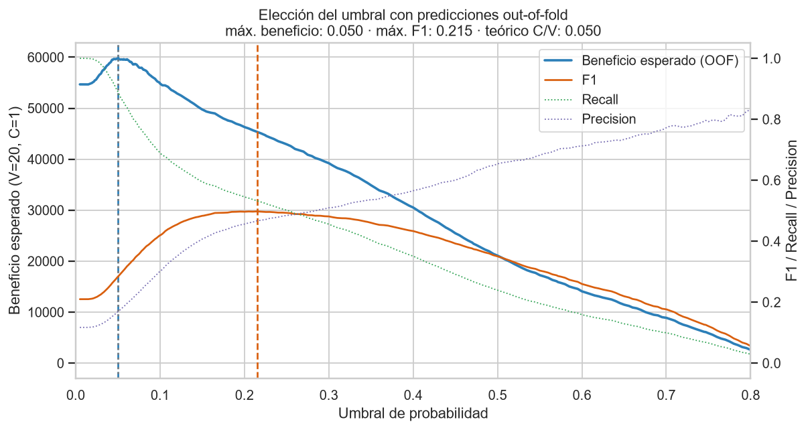

*Tabla 8. Sensibilidad del umbral al ratio V/C (predicciones OOF de train).*

| V/C | Umbral teórico C/V | Umbral óptimo OOF | % contactado | Recall | Beneficio modelo | Beneficio contactar a todos |
|---|---|---|---|---|---|---|
| 5 | 0,200 | 0,165 | 15,9 | 0,582 | 7.377 | -16.850 |
| 10 | 0,100 | 0,110 | 24,0 | 0,670 | 22.207 | 6.990 |
| 20 | 0,050 | 0,050 | 61,9 | 0,891 | 59.772 | 54.670 |
| 50 | 0,020 | 0,023 | 97,0 | 0,996 | 197.885 | 197.710 |

<!-- pagebreak -->

## 5. Evaluación y análisis

### 5.1 Resultados en el hold-out

**Condiciones de la evaluación:**

- El modelo, los hiperparámetros y el umbral quedaron fijados antes de leer el conjunto de test.
- La evaluación se realizó **una única vez** (`reports/tables/holdout_usage.json`).
- El umbral de la regresión logística también se eligió con sus propias predicciones *out-of-fold*.

*Tabla 9. Métricas en test.*

| Modelo | ROC-AUC | PR-AUC | Lift@10 % | Lift@20 % | Gain@20 % | Brier | Umbral | Precision | Recall | F1 |
|---|---|---|---|---|---|---|---|---|---|---|
| LightGBM (final, pre-contacto) | 0,784 | 0,435 | 4,21 | 2,98 | 59,7 % | 0,082 | 0,050 | 0,163 | 0,866 | 0,275 |
| Regresión logística (baseline) | 0,738 | 0,349 | 3,81 | 2,45 | 49,1 % | 0,183 | 0,275 | 0,145 | 0,900 | 0,250 |
| Dummy (prior) | 0,500 | 0,115 | 1,09 | 0,99 | 19,8 % | 0,102 | 0,050 | 0,115 | 1,000 | 0,207 |
| LightGBM + duration (leakage) | 0,933 | 0,607 | 5,48 | 4,16 | 83,3 % | 0,062 | 0,050 | 0,326 | 0,969 | 0,488 |

*Tabla 10. Validación cruzada vs test (modelo final).*

| Métrica | CV (media ± desvío) | Test |
|---|---|---|
| roc_auc | 0,806 ± 0,010 | 0,784 |
| pr_auc | 0,466 ± 0,020 | 0,435 |
| lift@10 | 4,401 ± 0,157 | 4,214 |
| lift@20 | 3,152 ± 0,070 | 2,982 |
| lift@30 | 2,386 ± 0,047 | 2,257 |
| gain@20 | 0,631 ± 0,014 | 0,597 |
| brier | 0,081 ± 0,002 | 0,082 |

La PR-AUC en test es -0,031 menor que en validación cruzada. La diferencia está dentro de dos
desvíos y es esperable por dos razones:

- el leve optimismo del tuning;
- el menor tamaño del test (521 conversiones).

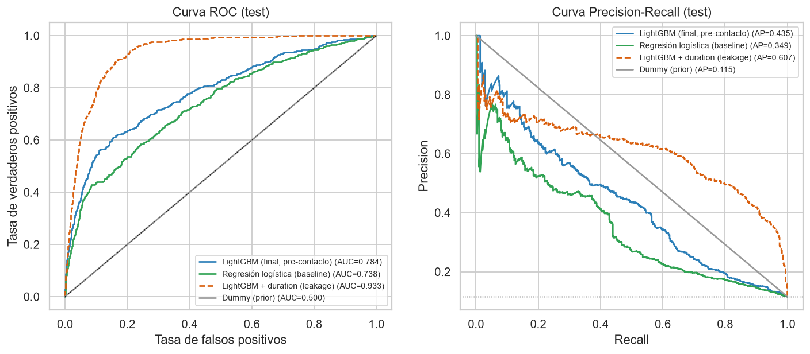

### 5.2 Decisión al umbral operativo

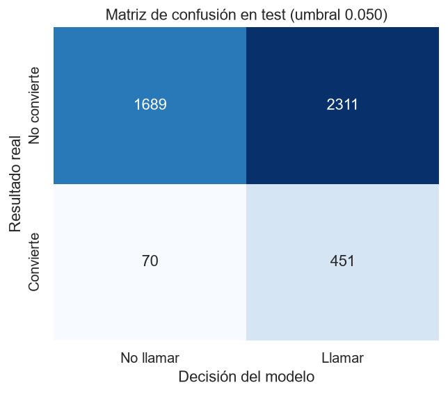

**Resultados con umbral 0,050:**

- el modelo recomienda contactar al 61,1 % de los clientes;
- captura 451 de las 521 conversiones (recall 86,6 %, precision 16,3 %);
- genera 2.311 falsos positivos y 70 falsos negativos.

Los falsos positivos son aceptables por diseño: una llamada sin conversión cuesta 1 y una
conversión perdida cuesta 20.

### 5.3 Ranking, deciles y beneficio

*Tabla 11. Deciles en test (decil 1 = mayor probabilidad).*

| Decil | Clientes | Conversiones | Tasa | Lift | % contactado acum. | Gain acumulado | Lift acumulado |
|---|---|---|---|---|---|---|---|
| 1 | 453 | 220 | 48,6 % | 4,21 | 10 % | 42,2 % | 4,21 |
| 2 | 452 | 91 | 20,1 % | 1,75 | 20 % | 59,7 % | 2,98 |
| 3 | 452 | 42 | 9,3 % | 0,81 | 30 % | 67,8 % | 2,26 |
| 4 | 452 | 35 | 7,7 % | 0,67 | 40 % | 74,5 % | 1,86 |
| 5 | 452 | 33 | 7,3 % | 0,63 | 50 % | 80,8 % | 1,62 |
| 6 | 452 | 26 | 5,8 % | 0,50 | 60 % | 85,8 % | 1,43 |
| 7 | 452 | 31 | 6,9 % | 0,60 | 70 % | 91,7 % | 1,31 |
| 8 | 452 | 15 | 3,3 % | 0,29 | 80 % | 94,6 % | 1,18 |
| 9 | 452 | 19 | 4,2 % | 0,36 | 90 % | 98,3 % | 1,09 |
| 10 | 452 | 9 | 2,0 % | 0,17 | 100 % | 100,0 % | 1,00 |

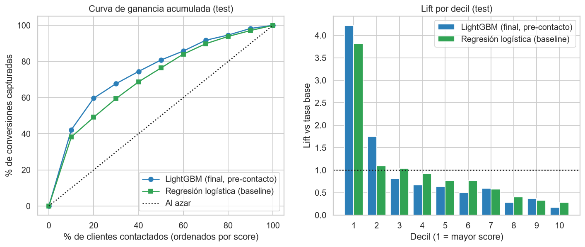

*Tabla 12. Traducción a negocio (test, V = 20, C = 1).*

| Estrategia | Contactos | % contactado | Conversiones | % de conversiones capturadas | Beneficio (V=20, C=1) | vs contactar a todos |
|---|---|---|---|---|---|---|
| Top 10 % del ranking | 453 | 10,0 % | 220 | 42,2 % | 3.947 | -1.952 |
| Top 20 % del ranking | 905 | 20,0 % | 311 | 59,7 % | 5.315 | -584 |
| Top 30 % del ranking | 1.357 | 30,0 % | 353 | 67,8 % | 5.703 | -196 |
| Umbral operativo (0.050) | 2.762 | 61,1 % | 451 | 86,6 % | 6.258 | 359 |
| Contactar a todos | 4.521 | 100,0 % | 521 | 100,0 % | 5.899 | 0 |
| No contactar a nadie | 0 | 0,0 % | 0 | 0,0 % | 0 | -5.899 |

**Lectura de negocio:**

- **Top 10 %**: el decil superior concentra 220 conversiones, con una tasa de 48,6 %
  y un lift de 4,21.
- **Top 20 %**: contactando al 20 % mejor rankeado se captura el 59,7 % de las conversiones.
- **Umbral operativo**: el beneficio esperado es 6.258 frente a 5.899 de contactar a
  todos (+359, 6,1 %).

*Tabla 13. Sensibilidad V/C en test (umbrales elegidos con train).*

| V/C | Umbral (elegido en OOF) | % contactado | % conversiones | Beneficio modelo | Beneficio contactar a todos | Diferencia |
|---|---|---|---|---|---|---|
| 5 | 0,165 | 15,5 % | 54,5 % | 718 | -1.916 | 2.634 |
| 10 | 0,110 | 23,3 % | 62,4 % | 2.195 | 689 | 1.506 |
| 20 | 0,050 | 61,1 % | 86,6 % | 6.258 | 5.899 | 359 |
| 50 | 0,023 | 97,3 % | 99,6 % | 21.549 | 21.529 | 20 |

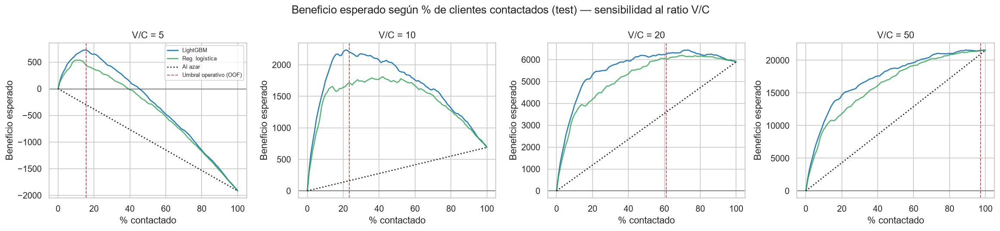

**El valor del modelo depende del ratio V/C:**

| V/C | Contactar a todos | Modelo | Lectura |
|---|---|---|---|
| 5 | -1.916 (pérdida) | 718 | El modelo convierte una pérdida en ganancia |
| 10 | 689 | 2.195 | El modelo triplica el beneficio |
| 50 | — | — | Conviene contactar a casi todos (el modelo contacta al 97,3 %) |

Cuando existe un presupuesto fijo de contactos, lo relevante es la calidad del ranking.

### 5.4 Calibración

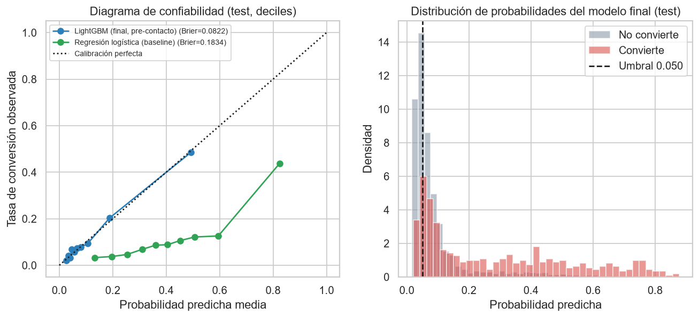

**LightGBM** (Brier 0,082): las probabilidades siguen de cerca la diagonal, lo que
permite usarlas para estimar conversiones y beneficio esperados.

**Regresión logística con pesos de clase** (Brier 0,183): sobreestima
sistemáticamente la probabilidad. Por ese motivo su umbral óptimo es 0,275.

### 5.5 Cuantificación del leakage

*Tabla 14. Pre-contacto vs con `duration` (test).*

| Modelo | ROC-AUC | PR-AUC | Lift@10 % | Gain@20 % |
|---|---|---|---|---|
| LightGBM (final, pre-contacto) | 0,784 | 0,435 | 4,21 | 59,7 % |
| LightGBM + duration (leakage) | 0,933 | 0,607 | 5,48 | 83,3 % |

**Magnitud del efecto:**

| Métrica | Pre-contacto | Con `duration` |
|---|---|---|
| ROC-AUC en test | 0,784 | 0,933 |
| ROC-AUC en CV | 0,806 | 0,937 |

**Por qué la mejora es engañosa:**

- Para conocer la duración es necesario haber realizado la llamada, que es justamente lo que el
  modelo debe decidir.
- La relación causal está invertida: la llamada es larga porque el cliente está interesado.

Un modelo con `duration` exhibiría métricas excelentes en validación y no podría utilizarse en
producción.

### 5.6 Explicabilidad

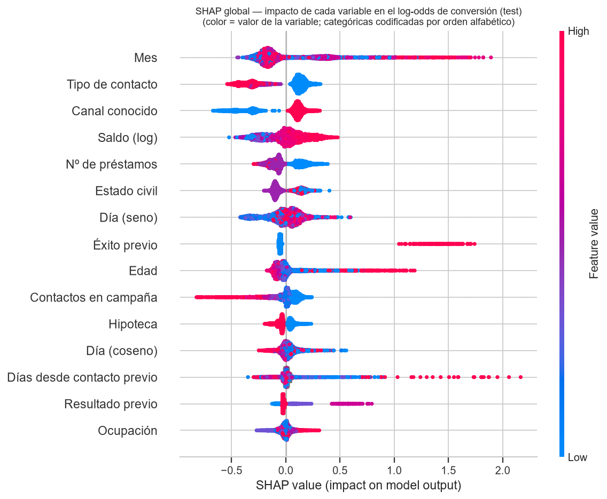

*Tabla 15. Importancia global (media del valor absoluto de SHAP, test).*

| Variable | Media |SHAP| | % de la importancia |
|---|---|---|
| Mes | 0,2641 | 14,9 % |
| Tipo de contacto | 0,2062 | 11,6 % |
| Canal conocido | 0,1944 | 11,0 % |
| Saldo (log) | 0,1362 | 7,7 % |
| Nº de préstamos | 0,1194 | 6,7 % |
| Estado civil | 0,1125 | 6,3 % |
| Día (seno) | 0,1070 | 6,0 % |
| Éxito previo | 0,0944 | 5,3 % |
| Edad | 0,0912 | 5,1 % |
| Contactos en campaña | 0,0893 | 5,0 % |

**Variables más influyentes:**

- **Mes** (14,9 %):
  - marzo, septiembre, octubre y diciembre aumentan fuertemente la probabilidad;
  - enero, mayo y agosto la reducen;
  - como se observó en el EDA, refleja la operación y el período. Es el principal riesgo al
    aplicar el modelo en campañas futuras.
- **Canal de contacto** (22,6 %, entre `contact` y `contact_known`): `unknown`
  reduce la probabilidad.
- **Saldo**: tiene un efecto creciente a partir de saldos positivos.
- **Préstamos**: tener uno o más reduce la probabilidad.
- **Éxito en la campaña anterior**: afecta a pocos clientes, pero con un efecto muy grande.
- **Cantidad de contactos en la campaña**: un número alto la reduce.

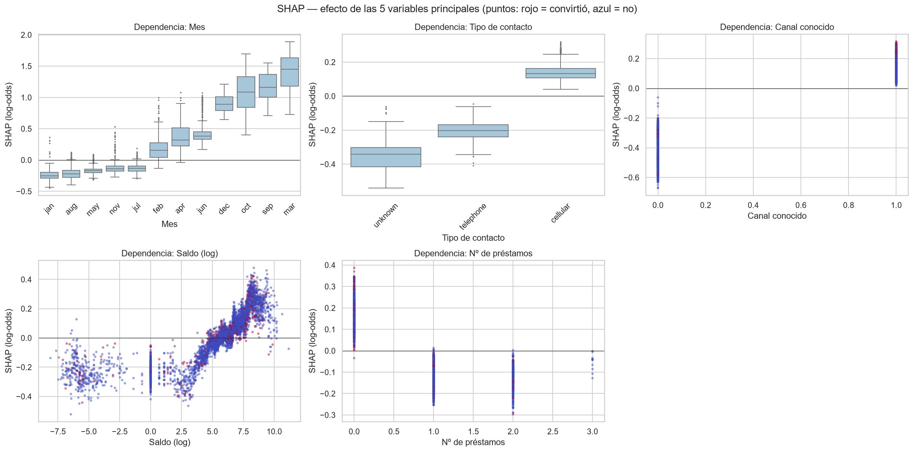

**Explicaciones locales:**

- **Verdadero positivo típico**: su probabilidad se explica principalmente por el mes (octubre)
  y la ausencia de préstamos.
- **Falso positivo de mayor probabilidad**: un jubilado con éxito en la campaña anterior,
  contactado en marzo. Todas las señales indicaban conversión, por lo que el error es razonable.
- **Falso negativo de menor probabilidad**: un cliente con contacto `unknown` en mayo, saldo cero y
  dos préstamos, es decir, el perfil de menor conversión del dataset.

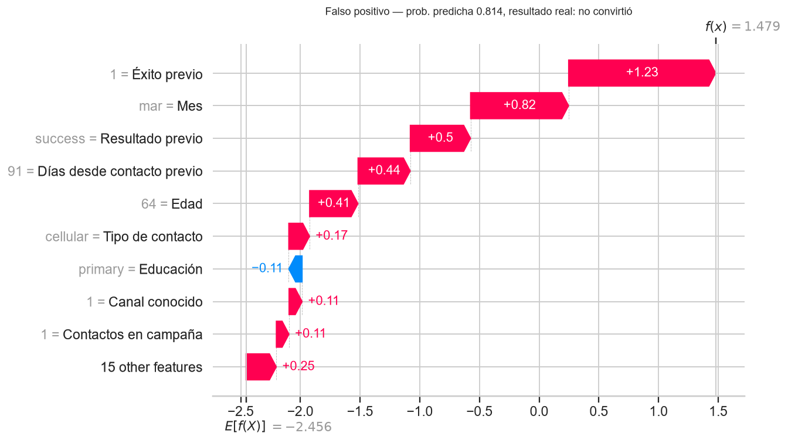

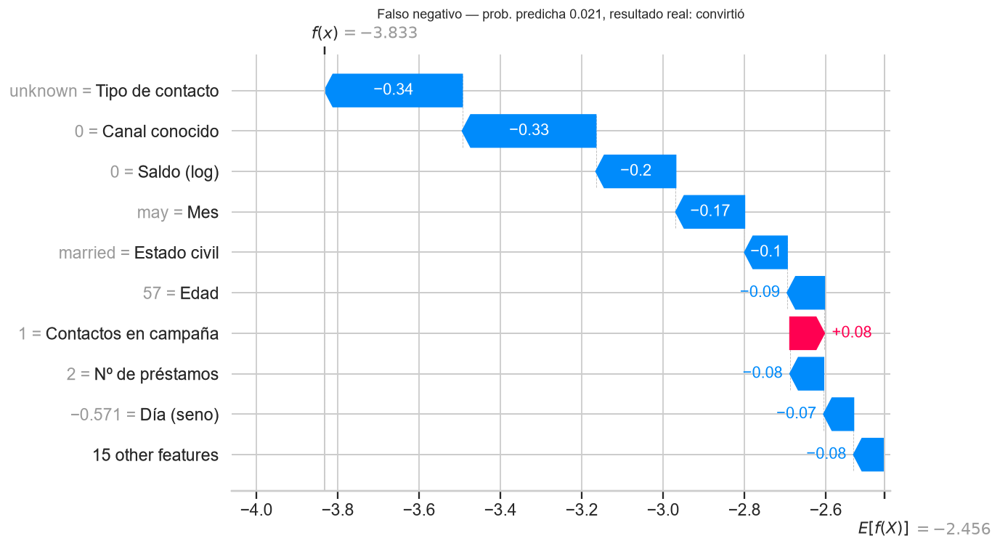

**Contraste con la regresión logística.** Los coeficientes de mayor magnitud también corresponden
al mes, al grupo de 65 años o más y al saldo. La coincidencia entre dos familias de modelos da
confianza en que las relaciones son reales.

*Tabla 16. Coeficientes principales de la regresión logística.*

| Variable | Coeficiente | Odds ratio |
|---|---|---|
| month_mar | 1,024 | 2,78 |
| month_nov | -0,981 | 0,37 |
| month_dec | 0,944 | 2,57 |
| age_group_65+ | 0,940 | 2,56 |
| month_jan | -0,845 | 0,43 |
| month_oct | 0,666 | 1,95 |
| month_may | -0,611 | 0,54 |
| month_sep | 0,551 | 1,74 |
| month_aug | -0,455 | 0,63 |
| month_jun | 0,430 | 1,54 |
| balance_log | 0,391 | 1,48 |
| prev_campaign_success | 0,370 | 1,45 |

**Reglas de negocio.** Un árbol de profundidad 3 entrenado con train (ROC-AUC en test
0,675) resume las reglas en un formato comunicable:

- éxito en la campaña anterior y sin hipoteca → más del 65 % de conversión;
- sin éxito previo, con préstamos y contacto no celular → alrededor del 4 %.

*Tabla 17. Reglas del árbol de profundidad 3.*

| Regla | Clientes (train) | % del train | Tasa de conversión | Lift |
|---|---|---|---|---|
| poutcome = success Y housing = no Y pdays_clean > 177.500 | 426 | 1,0 % | 75,1 % | 6,41 |
| poutcome = success Y housing = no Y pdays_clean <= 177.500 | 525 | 1,3 % | 65,9 % | 5,62 |
| poutcome = success Y housing = yes Y day_cos > -0.346 | 218 | 0,5 % | 60,6 % | 5,17 |
| poutcome = success Y housing = yes Y day_cos <= -0.346 | 213 | 0,5 % | 45,5 % | 3,89 |
| poutcome != success Y n_credit_products <= 0.500 Y season != summer | 6.048 | 14,9 % | 22,0 % | 1,88 |
| poutcome != success Y n_credit_products <= 0.500 Y season = summer | 8.369 | 20,6 % | 10,4 % | 0,89 |
| poutcome != success Y n_credit_products > 0.500 Y contact = cellular | 14.759 | 36,3 % | 8,5 % | 0,72 |
| poutcome != success Y n_credit_products > 0.500 Y contact != cellular | 10.132 | 24,9 % | 4,2 % | 0,36 |

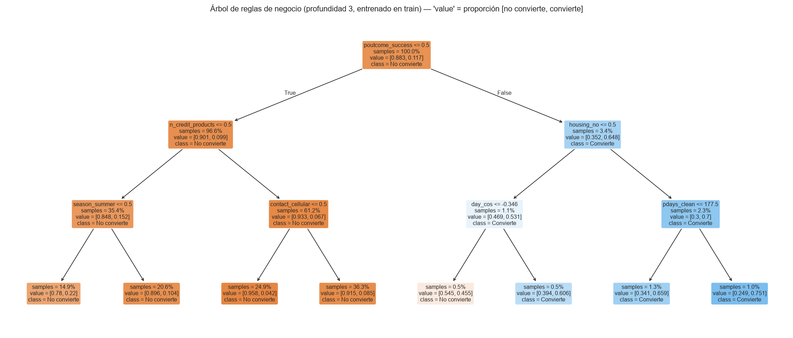

### 5.7 Análisis de errores y por segmento

*Tabla 18. Perfil de aciertos y errores (test).*

| Grupo | Clientes | Edad media | Saldo medio | Contactos campaña | % contactados antes | Prob. media |
|---|---|---|---|---|---|---|
| TP | 451 | 42,5 | 1.729 | 2,06 | 39,2 % | 0,325 |
| FN | 70 | 42,5 | 563 | 3,57 | 10,0 % | 0,039 |
| FP | 2.311 | 40,3 | 1.761 | 2,40 | 19,6 % | 0,131 |
| TN | 1.689 | 41,9 | 914 | 3,50 | 10,6 % | 0,036 |

**Falsos negativos.** Se parecen a los verdaderos negativos:

| Rasgo | Falsos negativos | Verdaderos positivos |
|---|---|---|
| Contacto `unknown` | 61 % | 4 % |
| Contactados en mayo | 49 % | 13 % |
| Saldo medio | 563 | 1.729 |
| Contactos en la campaña | 3,6 | 2,1 |
| Contactados antes | 10 % | 39 % |

Son conversiones que ocurrieron dentro de campañas masivas sin señales previas que las distingan.

*Tabla 19. Desempeño por segmento (segmentos con al menos 20 conversiones).*

| Variable | Segmento | Clientes | Conversiones | Tasa | ROC-AUC | Recall al umbral |
|---|---|---|---|---|---|---|
| age_group | 65+ | 89 | 32 | 36,0 % | 0,618 | 1,000 |
| age_group | 25-34 | 1.405 | 165 | 11,7 % | 0,760 | 0,891 |
| age_group | 45-54 | 1.008 | 114 | 11,3 % | 0,781 | 0,789 |
| age_group | 55-64 | 496 | 60 | 12,1 % | 0,788 | 0,850 |
| age_group | 35-44 | 1.456 | 137 | 9,4 % | 0,794 | 0,869 |
| contact | unknown | 1.324 | 61 | 4,6 % | 0,646 | 0,295 |
| contact | cellular | 2.896 | 416 | 14,4 % | 0,775 | 0,940 |
| contact | telephone | 301 | 44 | 14,6 % | 0,843 | 0,955 |
| job | blue-collar | 946 | 69 | 7,3 % | 0,727 | 0,754 |
| job | self-employed | 183 | 20 | 10,9 % | 0,734 | 0,850 |
| job | retired | 230 | 54 | 23,5 % | 0,750 | 0,889 |
| job | technician | 768 | 83 | 10,8 % | 0,760 | 0,831 |
| job | admin. | 478 | 58 | 12,1 % | 0,765 | 0,862 |
| job | management | 969 | 131 | 13,5 % | 0,804 | 0,916 |
| job | services | 417 | 38 | 9,1 % | 0,817 | 0,868 |

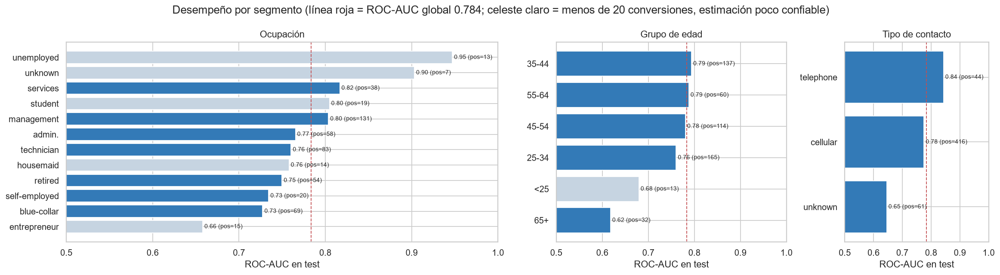

**Segmentos con peor desempeño:**

- **`contact = unknown`**: ROC-AUC 0,65, 1.324 clientes y
  4,6 % de conversión.
- **Mayores de 65 años**: ROC-AUC 0,62. Convierten mucho en promedio (36,0 %),
  pero el modelo discrimina poco dentro del grupo.

Para esos segmentos convendría incorporar información adicional.

### 5.8 Razonabilidad de los resultados

*Tabla 20. Chequeos de razonabilidad.*

| Chequeo | Valor | Referencia | Cumple |
|---|---|---|---|
| ROC-AUC sin duration vs referencia 0,75–0,80 | 0,784 | 0,75–0,80 (rango de referencia del enunciado para este dataset sin duration) | Sí |
| ROC-AUC con duration (leakage) en rango típico alto | 0,933 | > 0,90 esperado: duration por sí sola tiene ROC-AUC ≈ 0,81 en train | Sí |
| PR-AUC muy por encima del azar (prevalencia) | 0,435 | piso = prevalencia en test (0.115) | Sí |
| Modelo final supera a la regresión logística | 0,435 | PR-AUC logística = 0.3494 | Sí |
| PR-AUC en test dentro de ±2 desvíos de la CV | 0,435 | CV = 0.4660 ± 0.0201 | Sí |

Se cumplen 5 de 5 chequeos:

- El ROC-AUC en test (0,784) está dentro del rango de referencia de 0,75–0,80 para
  este dataset sin `duration`.
- La inclusión de `duration` lleva el valor por encima de 0,93.
- Un modelo pre-contacto con ROC-AUC mayor a 0,90 habría sido una señal de fuga de información.

<!-- pagebreak -->

## 6. Despliegue

El modelo final se serializó como un único pipeline (`models/model_final.joblib`) junto con su
metadata (`models/metadata.json`). La metadata incluye:

- hiperparámetros;
- métricas de validación cruzada;
- umbral;
- cortes de deciles;
- hash de los datos;
- versiones de las librerías.

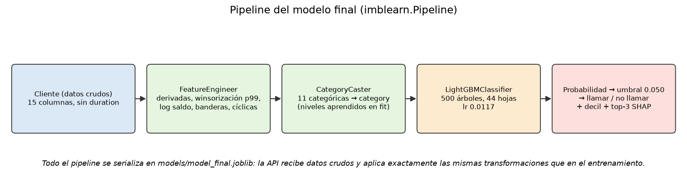

**API REST con FastAPI** (`app/api/main.py`, documentación automática en `/docs`):

| Endpoint | Función |
|---|---|
| `GET /health` | Estado del servicio |
| `GET /model/info` | Metadata del modelo |
| `POST /predict` | Recibe un cliente en JSON y devuelve la probabilidad, la recomendación, el decil, las tres variables SHAP de mayor peso y una explicación en texto |
| `POST /predict/batch` | Recibe un CSV y devuelve el mismo CSV rankeado con probabilidad, decil y recomendación |

La validación de las entradas se realiza con pydantic:

- enumeraciones para las variables categóricas;
- rangos para las numéricas;
- consistencia entre `pdays` y `previous`;
- **rechazo explícito de `duration`**.

**Interfaz con Streamlit** (`app/ui/streamlit_app.py`). Consume la API a través de la variable de
entorno `API_URL` y tiene dos pestañas:

- **Cliente individual**: formulario, resultado y explicación.
- **Campaña**:
  - carga de un CSV y ranking;
  - selección del porcentaje de clientes o del presupuesto;
  - conversiones y beneficio esperados;
  - descarga del listado priorizado.

**Contenedores.** El `Dockerfile` y el `docker-compose.yml` levantan la API y la UI. También se
documenta la ejecución local sin Docker.

**Pruebas.** La suite de tests automáticos (`pytest`) verifica:

- las transformaciones de variables;
- la ausencia de fugas: `duration` fuera del modelo e independencia entre train y test;
- la consistencia del modelo y de la metadata;
- todos los endpoints de la API, incluido el rechazo de `duration`.

<!-- pagebreak -->

## 7. Conclusiones y trabajo futuro

**Conclusiones:**

1. Con la información disponible **antes** del contacto es posible priorizar clientes con un
   poder de discriminación moderado y consistente: ROC-AUC 0,784, PR-AUC
   0,435 y lift de 4,21 en el decil superior.
2. El valor de negocio depende del cociente entre el valor de una conversión y el costo de un
   contacto:
   - es alto cuando las llamadas son caras o el presupuesto es limitado;
   - es marginal cuando conviene contactar a casi todos.
3. Las decisiones metodológicas más relevantes no fueron algorítmicas sino de tratamiento de los
   datos:
   - detectar y eliminar el solapamiento entre train y test;
   - excluir `duration`;
   - preferir probabilidades calibradas en lugar de técnicas de rebalanceo.
4. Los ensambles de árboles superan a los modelos lineales, pero la mejora por tuning es pequeña:
   el límite lo impone la información disponible.

**Limitaciones y trabajo futuro:**

- **Temporalidad.** Los datos son una serie temporal (2008–2010) con un fuerte drift en la tasa
  de conversión, y la partición provista es aleatoria. Antes de usar el modelo en campañas nuevas
  se recomienda:
  - validar con un esquema temporal;
  - monitorear el efecto de `month`.
- **Parámetros económicos.** Reemplazar los supuestos de C y V por valores reales del banco.
- **Nuevas fuentes de información.** Incorporar variables transaccionales y de relación con el
  cliente para mejorar los segmentos con peor desempeño.
- **Uplift modeling.** Estimar el efecto causal de la llamada, en lugar de la probabilidad de
  conversión, requeriría datos de un grupo de control no contactado.

<!-- pagebreak -->

## Anexos

### Anexo A. Registro de decisiones (decision log)

## Decision log

Registro de cada decisión metodológica del trabajo. Formato: **contexto**, **alternativas**,
**elección**, **justificación** y **evidencia** (tabla o figura generada por el pipeline).

---

### Fase 0 — Datos

#### D01 · Eliminación del solapamiento entre train y test

- **Contexto.** Al comparar los archivos se detectó que las **4.521 filas de
  `banca_test.csv` (100 %) aparecen idénticas en `banca_train.csv`**. Los archivos
  corresponden al dataset *Bank Marketing* de UCI: `banca_train` = `bank-full.csv` (45.211
  filas) y `banca_test` = `bank.csv` (4.521 filas), que es una muestra del 10 % de bank-full.
- **Alternativas.** (a) Usar los archivos tal cual. (b) Descartar `banca_test` y armar un
  hold-out propio desde train. (c) Quitar de train las filas que están en test.
- **Elección.** (c): train pasa de 45.211 a **40.690 filas**; test queda con sus 4.521.
- **Justificación.** Con (a) el modelo vería durante el entrenamiento exactamente los casos
  con los que después se lo evalúa: las métricas del hold-out serían optimistas y no medirían
  generalización (un árbol profundo o un KNN con k=1 casi "memorizarían" el test). La opción
  (b) desaprovecha el archivo de test que provee la consigna. La (c) respeta la consigna,
  conserva el 90 % de los datos para entrenar y garantiza un hold-out independiente.
- **Evidencia.** `reports/tables/data_preparation_steps.csv` (paso 6),
  `reports/tables/data_summary.csv` (`test_rows_found_in_train = 4521`); el código verifica
  con un `assert` que tras la limpieza el solapamiento es 0 (`data.py`).

#### D02 · Naturaleza de la partición: aleatoria, no temporal

- **Contexto.** bank-full está ordenado cronológicamente (mayo 2008 a noviembre 2010). Si el
  test fuera un corte temporal habría que evitar features que usen información del futuro y
  validar con un esquema temporal.
- **Alternativas.** Tratar la partición como temporal (validación *walk-forward*) o como
  aleatoria (validación cruzada estratificada).
- **Elección.** Aleatoria → `StratifiedKFold` de 5 folds.
- **Justificación.** Las posiciones de las filas de test dentro del archivo de train son
  compatibles con una distribución uniforme (Kolmogorov-Smirnov: D = 0,014, p = 0,37;
  posición media relativa 0,495, se esperaría ~1 si fuera el final). Las distribuciones de
  `month` (χ² p = 0,47), `contact` (p = 0,54), `poutcome` (p = 0,20) y del target
  (p = 0,72) no difieren entre train limpio y test.
- **Evidencia.** `reports/tables/split_checks.csv`.
- **Limitación a documentar.** Aunque la partición es aleatoria, los datos reales son una
  serie temporal (2008–2010, crisis financiera). Un despliegue real requeriría validar sobre
  un período posterior; con esta partición no es posible medir la degradación temporal.

#### D03 · Faltantes codificados, no nulos

- **Contexto.** No hay valores nulos (`NaN`) en ningún archivo. La información faltante está
  codificada como la categoría `unknown` (`job` 0,6 %, `education` 4,1 %, `contact` 28,8 %,
  `poutcome` 81,7 % en train) y como `pdays = -1` (cliente nunca contactado).
- **Elección.** `unknown` se mantiene como **categoría propia**; no se imputa a la moda.
- **Justificación.** El faltante no es aleatorio: por ejemplo, `poutcome = unknown` equivale a
  "sin campaña previa", y `contact = unknown` se concentra en los primeros meses del registro.
  Imputar destruiría esa información. La evidencia bivariada (tasa de conversión por categoría)
  se presenta en la Fase 2.
- **Evidencia.** `reports/tables/data_profile.csv` (columna `pct_unknown`).

#### D04 · Seguimiento de las transformaciones sobre los datos

- **Elección.** Todo paso que modifica o verifica filas queda en
  `reports/tables/data_preparation_steps.csv`, y todo paso que crea o transforma columnas
  queda en `reports/tables/feature_catalog.csv` (Fase 3). La explicación narrativa completa
  está en `docs/03_preparacion_datos.md`.

---

### Fase 1 — Negocio

#### D05 · Enfoque de ranking y métricas primarias

- **Contexto.** El problema de negocio es priorizar a quién llamar con presupuesto limitado.
- **Alternativas.** Evaluar como clasificador (accuracy, F1 a umbral 0,5) o como ranking
  (PR-AUC, lift/gain).
- **Elección.** Ranking: PR-AUC y lift/gain al 10/20/30 % como métricas primarias.
- **Justificación.** Ver `docs/01_negocio.md`: con 88,3 % de negativos, accuracy premia al
  modelo trivial; PR-AUC y lift miden directamente lo que el banco necesita.

#### D06 · Parámetros económicos C = 1, V = 20

- **Elección.** C = 1, V = 20 (umbral económico teórico p > 0,05) con sensibilidad V/C ∈
  {5, 10, 20, 50}.
- **Justificación.** Son supuestos explícitos y parametrizados; el análisis de sensibilidad
  muestra cómo cambia la decisión si el banco usa valores reales.

---

### Fase 3 — Preparación de los datos

#### D07 · Variables derivadas

Cada variable, su origen y su justificación están en `reports/tables/feature_catalog.csv`.
Resumen:

| Variable | Decisión | Evidencia del EDA |
|---|---|---|
| `previously_contacted`, `pdays_clean` | Separar la bandera "nunca contactado" del número de días (NaN si -1) | Las 33.249 filas con pdays = -1 son exactamente las de previous = 0; conversión 9,2 % vs 23,1 % |
| `campaign_w`, `previous_w` | Winsorizar al p99 **aprendido en cada fold** (en train completo: campaign ≤ 17, previous ≤ 9) | Máximo de 63 contactos; cola larga |
| `balance_log`, `balance_negative`, `balance_zero` | Log con signo + banderas; **no se eliminan outliers** | Asimetría 8,5; 10,4 % de outliers IQR que son saldos reales |
| `age_group` | Bins además de la edad numérica | Conversión alta en < 25 y 65+ |
| `contact_known`, `prev_campaign_success` | Banderas binarias | contact = unknown: 4,0 %; poutcome = success: 64,8 % |
| `season`, `day_sin`, `day_cos` | Estación y codificación cíclica del día | Meses con poco volumen; el día 31 está al lado del 1 |
| `n_credit_products` | housing + loan + default | Los préstamos reducen la conversión |

- **Alternativa descartada: eliminar outliers de `balance`.** Se perdería un 10 % de
  clientes reales y el modelo no sabría puntuarlos en producción.
- **Alternativa descartada: imputar `unknown` a la moda.** Ver D03.
- **Nota técnica.** La bandera se llamó inicialmente `poutcome_success`, pero ese nombre chocaba
  con la columna one-hot de la categoría `success` de `poutcome`. Se renombró a
  `prev_campaign_success`. La redundancia con la columna one-hot no afecta a los árboles; en la
  logística queda absorbida por la regularización L2.

#### D08 · Preprocesamiento por familia de modelo

- **Lineales, KNN, MLP y SVM**: imputación por mediana (solo afecta a `pdays_clean`),
  `StandardScaler` y one-hot con `handle_unknown='ignore'` (67 columnas). Estos modelos son
  sensibles a la escala.
- **Árboles y boosting con one-hot**: imputación con -1 y sin escalado, porque los árboles son
  invariantes a transformaciones monótonas.
- **LightGBM y XGBoost con categorías nativas**: las categóricas pasan como dtype `category` y
  los NaN quedan sin imputar.
- **Naive Bayes**: numéricas continuas discretizadas en quintiles y categóricas ordinales, porque
  CategoricalNB requiere variables discretas.
- **Todo dentro de un `Pipeline`**, ajustado solo con los folds de entrenamiento. El modelo
  final recibe datos crudos; la API no reimplementa el preprocesamiento.

#### D09 · Dos conjuntos de variables

- `pre_contact` (entregable): 24 variables, **sin `duration`**. `FeatureEngineer` descarta
  `duration` aunque venga en los datos (lo verifica `tests/test_leakage.py`).
- `with_duration`: la misma configuración más `duration`, solo para cuantificar el leakage (D18).

---

### Fase 4 — Modelado

#### D10 · Protocolo de validación

- `StratifiedKFold(5, shuffle=True, random_state=42)` sobre las 40.690 filas.
- Todos los modelos usan exactamente la misma partición (`reports/tables/cv_folds.csv`).
- Se reporta media ± desvío por fold (`cv_results.csv`, `cv_results_folds.csv`).

#### D11 · Algoritmos comparados (10) y por qué

| Modelo | Familia | Por qué se prueba | PR-AUC CV |
|---|---|---|---|
| Dummy (prior) | Referencia | Piso: PR-AUC = prevalencia | 0,117 |
| Regresión logística (balanced) | Lineal | Baseline interpretable | 0,412 ± 0,012 |
| Árbol de decisión (prof. 6) | Árboles | Reglas explicables | 0,351 ± 0,020 |
| KNN (k = 51) | Instancias | No paramétrico, por similitud | 0,401 ± 0,020 |
| Naive Bayes categórico | Probabilístico generativo | Simple y rápido; referencia | 0,395 ± 0,019 |
| Random Forest | Bagging | Robusto, baja varianza | 0,446 ± 0,023 |
| LightGBM | Boosting | Estado del arte en datos tabulares | **0,457 ± 0,020** |
| XGBoost (scale_pos_weight) | Boosting | Boosting regularizado | 0,454 ± 0,021 |
| MLP (64-32) | Redes neuronales | Representante de redes neuronales | 0,430 ± 0,020 |
| SVM RBF (submuestra 10k) | Kernels | Frontera no lineal de máximo margen | 0,362 ± 0,020 |

La SVM tiene costo O(n²), por eso se entrenó sobre una submuestra estratificada de 10.000
filas. Se evalúa sobre el fold de validación completo usando `decision_function`, así que no
tiene Brier.

#### D12 · Codificación de categóricas en boosting

- **LightGBM**: la codificación nativa (0,4580) superó al one-hot (0,4567) → se usa **nativa**.
- **XGBoost**: el one-hot (0,4541) superó a la nativa (0,4509) por más de la tolerancia de 0,003
  → se usa **one-hot**.
- Evidencia: `encoding_comparison.csv`.

#### D13 · Estrategia de desbalance

- **Contexto.** Se compararon tres estrategias sobre los 3 mejores modelos (LightGBM, XGBoost y
  Random Forest):
  - (a) sin tratamiento, con ajuste de umbral;
  - (b) pesos de clase;
  - (c) SMOTE dentro del pipeline.
- **Resultados.**

  | Modelo | Métrica | (a) Sin tratamiento | (b) Pesos | (c) SMOTE |
  |---|---|---|---|---|
  | LightGBM | PR-AUC | 0,459 | 0,458 | 0,455 |
  | LightGBM | Brier | 0,081 | 0,144 | 0,082 |
  | Random Forest | PR-AUC | 0,451 | 0,446 | 0,436 |

- **Elección.** **(a) sin tratamiento + ajuste de umbral**, para los tres modelos.
- **Justificación.**
  - Las diferencias de PR-AUC son menores que un desvío entre folds.
  - Los pesos de clase **descalibran** las probabilidades: el Brier casi se duplica. El umbral y
    el beneficio esperado dependen de probabilidades bien calibradas.
  - SMOTE interpola clientes sintéticos sobre variables one-hot, algo que no tiene
    interpretación, y además empeora al Random Forest.
  - Regla aplicada: si la diferencia de PR-AUC es menor a 0,003, se prefiere la estrategia que
    no distorsiona las probabilidades.
- **Evidencia.** `imbalance_results.csv`, `imbalance_comparison.png`.

#### D14 · Tuning

- **Método.** Optuna con sampler TPE (semilla 42), 60 trials por modelo y tope de 15 minutos.
  El objetivo es la PR-AUC media en los mismos 5 folds.
- **Resultados.**
  - LightGBM: de 0,4589 a **0,4660** (≈ 67 s).
  - XGBoost: de 0,4522 a 0,4629.
- **Mejores hiperparámetros de LightGBM.** n_estimators 500, learning_rate 0,0117, num_leaves 44,
  min_child_samples 20, subsample 0,68, colsample_bytree 0,63 y regularización L1/L2 baja.
- **Espacios de búsqueda.** `models.suggest_params`.
- **Evidencia.** `tuning_summary.csv`, `tuning_trials_*.csv`, `tuning_convergence_*.png`.
- **Limitación.** La PR-AUC del mejor trial es optimista porque se eligió mirando los mismos
  folds. La estimación sin sesgo es la del hold-out.

#### D15 · Selección final (matriz de decisión)

- **Criterios y pesos.**
  - PR-AUC: 35 %
  - lift@20 %: 25 %
  - estabilidad (desvío de PR-AUC): 15 %
  - interpretabilidad (escala 1–5): 15 %
  - velocidad de inferencia: 10 %
- **Normalización.** Min-max entre candidatos.
- **Puntaje ponderado.**

  | Candidato | Puntaje |
  |---|---|
  | **LightGBM tuneado** | **0,690** |
  | XGBoost tuneado | ≈ 0,65–0,67 |
  | XGBoost por defecto | ≈ 0,64–0,65 |
  | LightGBM por defecto | 0,632 |
  | Regresión logística | 0,400 |

- **Evidencia.** `decision_matrix.csv`.
- **Nota de reproducibilidad.** Todas las métricas son idénticas entre ejecuciones (semilla 42).
  La única excepción es el tiempo de inferencia, que depende de la carga de la máquina, por lo
  que los puntajes de los candidatos no ganadores varían en la segunda o tercera cifra decimal.
  LightGBM tuneado gana en todas las ejecuciones: tiene la mejor PR-AUC y el mejor lift, y su
  puntaje no depende de la velocidad, porque es el más lento de los candidatos de boosting.
- **Por qué no la logística.** Es la más estable e interpretable, pero pierde 0,05 de PR-AUC
  (≈ 12 % relativo) y 0,3 de lift@20 %. La interpretabilidad de LightGBM se recupera con SHAP.

#### D16 · Umbral operativo

- **Método.** Se eligió con las predicciones out-of-fold del modelo final, maximizando
  V·TP − C·(TP+FP) con V = 20 y C = 1.
- **Umbral elegido: 0,050.** Coincide con el umbral teórico C/V, lo que indica probabilidades
  bien calibradas.
  - En OOF contacta al 61,9 %, con recall 0,891 y beneficio 59.772.
  - Contactar a todos daría 54.670.
- **Umbral que maximiza F1: 0,215.**
  - Contacta al 13,4 % y el beneficio baja a 45.363.
  - F1 pondera igual precisión y recall, e ignora que una conversión vale 20 veces una llamada.
- **Evidencia.** `threshold_choice.json`, `threshold_analysis.csv`, `sensitivity_oof.csv`,
  `threshold_selection.png`.

---

### Fase 5 — Evaluación

#### D17 · Uso único del hold-out

- `evaluate.py` y `explain.py` son los únicos módulos que leen el test.
- Cargan el modelo, los hiperparámetros y el umbral ya fijados en la Fase 4.
- El umbral de la logística se eligió con sus propias predicciones OOF de train.
- Ninguna decisión se tomó después de ver los resultados de test.
- Evidencia: `reports/tables/holdout_usage.json`, que registra fecha y hash del modelo evaluado.

#### D18 · Cuantificación del leakage

| Conjunto | ROC-AUC CV | PR-AUC CV | ROC-AUC test | PR-AUC test |
|---|---|---|---|---|
| pre_contact (entregable) | 0,806 | 0,466 | 0,784 | 0,435 |
| with_duration | 0,937 | 0,638 | 0,933 | 0,607 |

El modelo con `duration` **no se entrega**. Evidencia: `leakage_cv.csv`, `test_leakage.csv`.

#### D19 · Advertencia sobre `month`

- `month` es la variable más importante (15 % de la importancia SHAP).
- El EDA mostró que refleja el volumen de la operación y el período, no una característica del
  cliente.
- Se mantiene porque se conoce antes de llamar y la partición es aleatoria.
- Se recomienda monitorear su efecto y reentrenar con datos recientes antes de usar el modelo en
  campañas nuevas.


### Anexo B. Diagrama del flujo completo

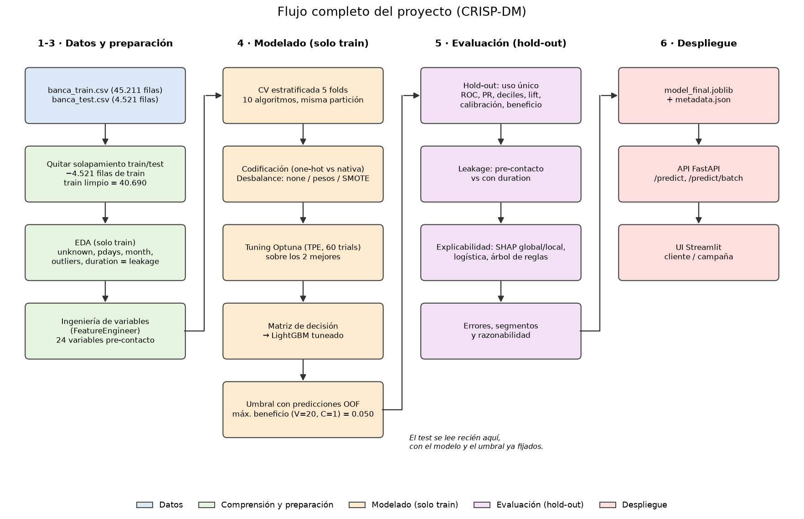

### Anexo C. Instrucciones de reproducción

```
python -m venv .venv
.venv\Scripts\activate            # Windows  (macOS: source .venv/bin/activate)
pip install -r requirements.txt
pip install -e .
# copiar banca_train.csv y banca_test.csv en data/raw/
python -m bank_captacion.pipeline # reconstruye datos, EDA, modelos, evaluación, notebooks e informe
python -m pytest -q               # tests
python -m uvicorn app.api.main:app --port 8000
python -m streamlit run app/ui/streamlit_app.py
```

Todas las tablas completas están en `reports/tables/` y todas las figuras en `reports/figures/`.
